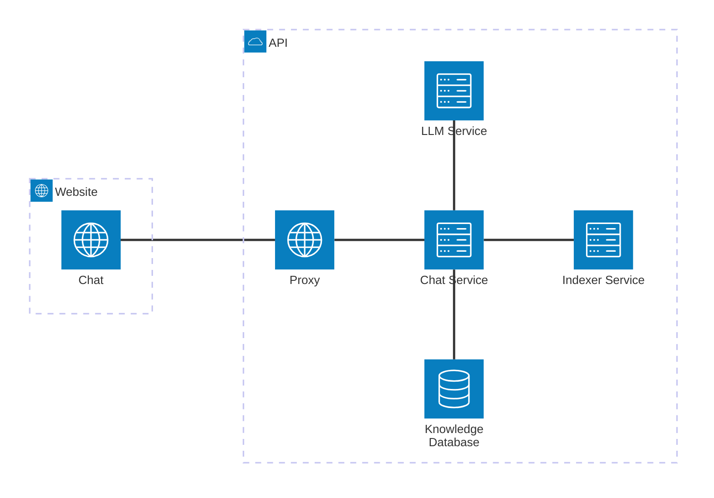
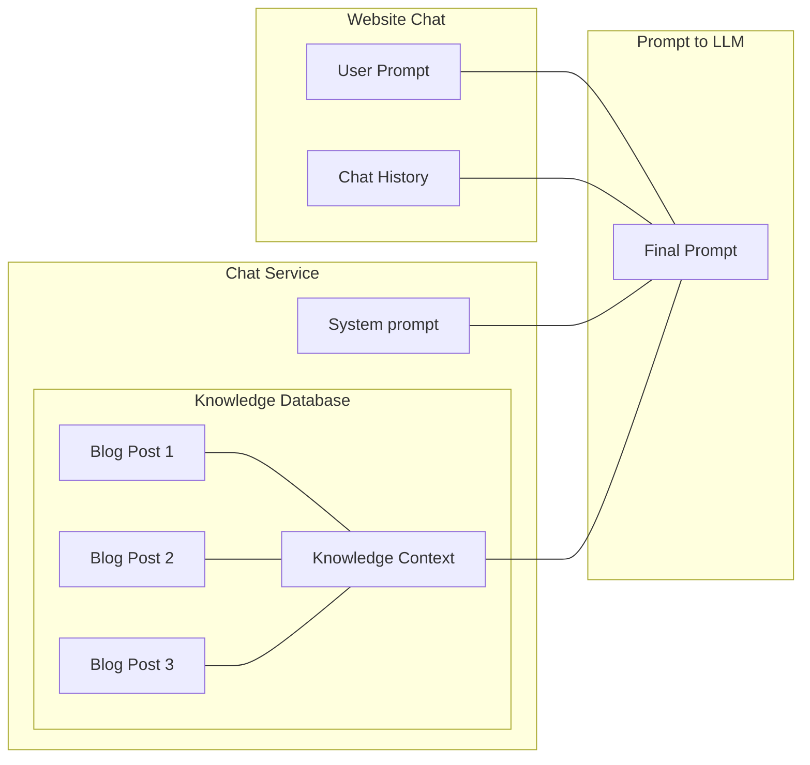

## Introduction

As a person that hasn't been involved into AI related field, I feel like within just a few years, AI became integrated everywhere. From note taking applications to customer service bots, it's now common. Most of the time, however, these integrations are just a thin layer over existing services like ChatGPT.

That is totally fine, I guess. Nobody is going to put effort into training their own model and building a cluster of GPUs. This is what we do with other tools anyway — use what is available instead of reinventing the wheel. Such solutions work fine, but I wanted to experiment with something more personal and self-hosted.

Another big thing I wanted is that my AI bot knows about my own content. I doubted this could be done just by integrating ChatGPT.

## Idea

My motivation was simple: I wanted to play with large language models (LLMs). Instead of just tinkering, I thought it would be fun to add an AI chat to my blog. The chat should be able to answer visitor questions, but also have knowledge of my blog posts.

That last requirement made things more complex. Blog content changes over time, so somehow I need to update the knowledge for the LLM model.

At first, I considered running a tiny LLM directly on the client device without backend. Most people visit my blog from PC, but still it's not good to expect an uncontrolled device to have enough resources. Besides, the model itself must be loaded, and that is not small. The smallest I found at that time was about 60 MB. Impressive, but not so tiny to be loaded as part of a website.

## Solution

### Requirements

Finally, I came up with the requirements for this project:

- **Self-hosted solution**
    Mostly for fun and experience. I prefer independent solution for this small project. It will be private and without extra costs.

- **Lightweight and low power consumption LLM**
    Since I will host it on my own server, it should be lightweight. Running LLMs today usually requires good hardware. People prefer cloud services, GPU providers, or LLM hosted somewhere else.

- **Knowledge of my blog posts, easy to update**
    I'm definitely not going to train a model. No resources for this. At first I thought this is the only way, and I was afraid because the task is huge. Imagine retraining each time I publish new post.
    This is where Retrieval-Augmented Generation (RAG) helps. LLMs have fixed knowledge cutoff. They can generate fluent text, but know nothing about my blog. With RAG, before sending the user's prompt, I retrieve related data from my blog and add it to the prompt. This way the model can answer questions with blog knowledge.

- **Behave on my behalf like visitors talk to me**
    I want the chat to look like I'm always available and replying 24/7. For this I need avatar, typing animation, and responses in my style. The last one is solved by proper role-based prompt template.

### Stack

Stack used:
- Python, FastAPI, Ollama, FAISS, Docker
- JavaScript, HTML, CSS

### Architecture

> For simplicity, I omit describing many parts of the entire solution like updating knowledge database, keeping the model heated and ready, limiting prompt requests and enqueuing the processing, as well as infrastructure in details including proxy server, HTTPS, etc.
{: .gh-alert.note }

Here is the high-level overview of the architecture.



A visitor accesses the chat, types a message, and clicks send. With a simple HTTP POST request through JavaScript fetch, the message is sent to backend. Proxy is responsible for routing to the proper service and handling things like HTTPS.

Then the request goes to chat service. It extracts relevant data from knowledge database, builds the final prompt, and passes it to LLM service. The result is returned to the website.

Blog indexer builds the knowledge database and keeps it updated with blog content. This can run on schedule or be triggered from outside (for example, CI job).

### LLM Service

I discovered a project named Ollama[^ollama]. It runs different language models[^models], provides an API, and manages models. You can install the Ollama app locally and play with chatbot just like ChatGPT. In this case, all prompts stay on your computer. There is also an official Docker image, which is what I need here.

Let's run Ollama container and see how it processes prompts using LLM. I use `qwen2` with 1.5 billion parameters — not so powerful like popular LLMs, but good enough for non-powerful machine.

- Run Ollama with Docker (omit using `--gpus all` if you want to use CPU only)

```bash
$ docker run -d \
  --name ollama \
  --gpus all
  -v ollama:/root/.ollama \
  -p 11434:11434 \
  ollama/ollama
```

- Download model `qwen2`

```bash
$ docker exec -it ollama ollama pull qwen2:1.5b
```

- Test it out by submitting a prompt

```bash
$ curl http://localhost:11434/api/generate -d '{
  "stream": false,
  "model": "qwen2:1.5b",
  "prompt": "Hello, who are you?"
}'
```

It should return the answer like the following.

```json
{
  "model":"qwen2:1.5b",
  "response":"I am an artificial intelligence designed to assist with information and answer questions to the best of my ability. How can I help you today?",
  "done":true
}
```

Ok, so I have a chatbot now that can reply to the messages. Next step is teach it the blog content, so it knows about it.

### Blog Indexer

Before chat can answer questions about my blog, I need to extract posts into a structured database. Luckily, my posts are in markdown, so I can parse them with a Python script.

```python
import os
import frontmatter

def process_posts(posts_dir="_posts"):
    """
    Process all markdown files in the given directory using python-frontmatter.
    Extract metadata and content.
    """
    results = []
    for filename in os.listdir(posts_dir):
        if filename.endswith(".md"):
            filepath = os.path.join(posts_dir, filename)

            # Load post with frontmatter
            post = frontmatter.load(filepath)

            results.append({
                "filename": filename,
                "metadata": dict(post.metadata),
                "content": post.content.strip()
            })
    return results


if __name__ == "__main__":
    # Assuming markdown files are already on disk
    posts_data = process_posts("_posts")
    for post in posts_data:
        print(f"\nFile: {post['filename']}")
        print("Metadata:", post["metadata"])
        print("Content preview:", post["content"][:200], "...")
```

Here is a sample output of this code.

```bash
File: example.md
Metadata: {'title': 'My Post', 'date': datetime.date(2025, 9, 10), 'tags': ['python', 'script']}
Content preview: Here is the content of the post... ...
```

### Knowledge Database

Next step would be to store all the data I extract, so it can be used later on. Here is how I'm going to use it exactly.



The system prompt is a static string. User prompt is what the service receives from the user interacting with frontend. The last piece is a knowledge context. This is what turns the model response from general purpose to an expert of my knowledge, or blog content. Every time the prompt is being sent to the model, it will contain the relevant information to the user question or message that helps the model to construct a better response taking this information into account. So, the better context we provide, the better answer will be.

It's completely up to us how we deal with relevant information search. We could search through the content by keywords and find articles containing some words, like typical search would work. However, there is a better approach of searching relevant information - vector search. Vector search is a way of finding information by comparing the mathematical representations (vectors) of items - such as text, images, audio, or video instead of using just exact keyword matching.

Here is an example program showing how vector search works. There is also a pre-trained model being used to do the job for text embeddings.

```python
from sentence_transformers import SentenceTransformer, util

# 1. Load model
model = SentenceTransformer("all-mpnet-base-v2")

# 2. Example corpus
corpus = [
    "Cats are independent and curious animals.",
    "Dogs are loyal pets and love human companionship.",
    "Elephants are the largest land animals and have strong memories.",
    "Dolphins are intelligent marine mammals known for their playful behavior.",
    "Tigers are powerful predators with distinctive stripes.",
    "Penguins are flightless birds that live in cold climates.",
    "Kangaroos are marsupials native to Australia and are great jumpers.",
    "Owls are nocturnal birds of prey with exceptional vision.",
    "Horses have been domesticated for transportation and sports for centuries.",
    "Bees are insects that play a crucial role in pollination."
]

# 3. Encode corpus
corpus_embeddings = model.encode(corpus, convert_to_tensor=True, normalize_embeddings=True)

# 4. Query
query = "Tell me about big cats."
query_embedding = model.encode(query, convert_to_tensor=True, normalize_embeddings=True)

# 5. Compute cosine similarity and get top results
cosine_scores = util.cos_sim(query_embedding, corpus_embeddings)[0]
top_results = cosine_scores.topk(k=3) # get top 3 results

# 6. Print results
print(f"\nQuery: {query}\n")
print("Top matches:")
for score, idx in zip(top_results[0], top_results[1]):
    print(f"- {corpus[idx]} (score: {score:.4f})")
```

Here is an output of this program below.

```bash
Query: Tell me about big cats.

Top matches:
- Cats are independent and curious animals. (score: 0.5703)
- Tigers are powerful predators with distinctive stripes. (score: 0.4677)
- Elephants are the largest land animals and have strong memories. (score: 0.3510)
```

There is no word "cat" in sentences containing tigers and elephants, but they are somehow related to the query - tigers are cats, elephants are big, and so they are present in the output. Using the matching score we could make a decision where or not to use each matched option.

I have to deal with bigger data than just a short list of sentences, so a few more things needs to be done here: split blog posts into chunks of data and store them to a database. Why would we need chunks? Well, keep in mind that all the relevant data will be a part of the final prompt to LLM. More data prompt contains the more accurate response may be. On the other hand, processing huge prompts requires more memory, power and the most important - time.

How exactly to split data into chunks depends on the data itself and how it is organized. In my case, for instance, separating by post chapters may work quite well. Once chunks are created, we can store them to a vector database like FAISS[^faiss].

### Chat Service

Finally, it's time to wire up it all together for the backend part. The whole story is about building an API with a single endpoint like `/chat` to listen for request with user prompt, merging it with other parts of prompts we discussed earlier and forward it to the LLM for processing. Then, return the answer to the user.

I have mentioned previously that I need to do some prompt engineering here. So, here is how it may look like.

```python
from fastapi import FastAPI
from pydantic import BaseModel
from ollama import chat

app = FastAPI()

class ChatRequest(BaseModel):
    question: str

@app.post("/chat")
def blog_author_response(request: ChatRequest):
    # Get previous messages for this conversation
    history = get_conversation_history()
    # Retrieve related information
    context = get_context()
    # Define the model behavior and rules
    system_prompt = """
You are a blog author responding to a reader's question in a helpful, friendly, and engaging tone.
Use the provided context to ensure accuracy, and refer to previous messages only if they are directly relevant.
Keep the response clear and concise, while adding value to the reader.
    """

    # Build final prompt
    prompt = f"""
Context (background information, facts, or references to use):
{context}

Conversation history (if relevant to the current question):
{history}

Reader's question:
{request.question}

Your response as the blog author:
"""

    # Call Ollama chat
    response = chat(
        model="qwen2:1.5b",
        messages=[
            {"role": "system", "content": system_prompt},
            {"role": "user", "content": prompt},
        ],
    )

    return {"response": response.message.content}
```

So now I can send the request to chat service like following.

```bash
curl -X POST http://localhost:8000/chat \
    -H "Content-Type: application/json" \
    -d '{"question": "What could be the use case for using YARP transformations?"}'
```

I have a blog post about YARP transformations I have used in one of my projects, so this would be a great relevant information for the model to reply on that question. Here is an example response from the service. We can see exactly what relevant information was used here.

```json
{
"answer": "The use case for using YARP in a project where you need to transform your existing backend's requests through middleware would be if you want to add new features without modifying the original service. By doing this, you can easily manage and adapt to changes in your web application without affecting the underlying infrastructure of the backend.",
"context_used":
    [
        {
        "metadata":
            {
            "title": "YARP Transformations"
            },
        "text": "*[YARP]: YARP (Yet Another Reverse Proxy) is an open-source reverse proxy toolkit designed for  NET applications.\n\n## Story\n\nI was working on a project where I was creating a separate web application for an existing backend service Since I had no way to modify the existing backend, I routed all requests through the YARP reverse proxy With the reverse proxy in the middle of the request chain, I could easily add new features to my web application without touching the original backend"
        },
        {
        "metadata":
            {
            "title": "YARP Transformations"
            },
        "text": "While creating new API endpoints for new features is straightforward because YARP uses .NET and the infrastructure of ASP.NET, there was one thing I had to deal with.\n\nThe idea was to keep the user signed in to the application, but the problem was that the existing backend service did not provide such a capability like a token refresh mechanism"
        },
        {
        "metadata":
            {
            "title": "Custom web application for existing service"
            },
        "text": "*[CORS]: Cross-Origin Resource Sharing (CORS) is an HTTP-header based mechanism that allows a server to indicate any origins (domain, scheme, or port) other than its own from which a browser should permit loading resources For security reasons, browsers restrict cross-origin HTTP requests initiated from scripts.\n*[YARP]: YARP (Yet Another Reverse Proxy) is an open-source reverse proxy toolkit designed for "
        }
    ],
"processing_time": 2.82554149627686
}
```

This looks like a good starting point to me. Let's integrate it with the blog.

### Frontend

There are ready-made WebUIs like Open WebUI[^open-webui]. But for my blog, I built simple frontend. It only needs a fetch to the chat service and small history management.

```javascript
const messageHistory = [];
const historyLength = 3;

async function askChatBot(question) {
  const response = await fetch(chatBotUrl, {
    method: 'POST',
    headers: { 'Content-Type': 'application/json' },
    body: JSON.stringify({ question : question, history: messageHistory}),
  });

  if (!response.ok) {
    throw new Error(`HTTP error! status: ${response.status}`);
  }

  const { answer } = await response.json();

  messageHistory.push(question);
  if (messageHistory.length > historyLength) {
    messageHistory.shift();
  }

  return answer.trim();
}
```

After all, I can chat with "myself" on my own blog.

{: .dark }
{: .light }
_Chat in action_

## What's next

With this project I only touched the surface of AI. Ollama can do much more than powering blog chat. For example:

- Private assistants running on your machine.
- Bots trained on internal documentation.
- Using open-source models for text and images.
- Adding tools so LLM can search or interact with applications.

Ollama makes it easy to experiment locally in customizable way.

## Conclusion

Honestly, it took me more time to write this post than to build the chat itself. That shows how powerful and ready the open-source tools are.

The project was fun and I learned a lot. I connected LLM to my own content and made the blog a bit more interactive. What started as a small experiment gave me ideas for more personal and professional use cases.

In the end, the hardest part is not tools but the data — how you prepare and feed it into the model.

If you are curious about LLMs, I really recommend trying Ollama. It's a simple way to bring your AI ideas to life.

## References
[^ollama]: [Ollama](https://ollama.com/)
[^models]: [Models](https://ollama.com/search)
[^faiss]: [FAISS](https://github.com/facebookresearch/faiss)
[^open-webui]: [Open WebUI](https://github.com/open-webui/open-webui)
