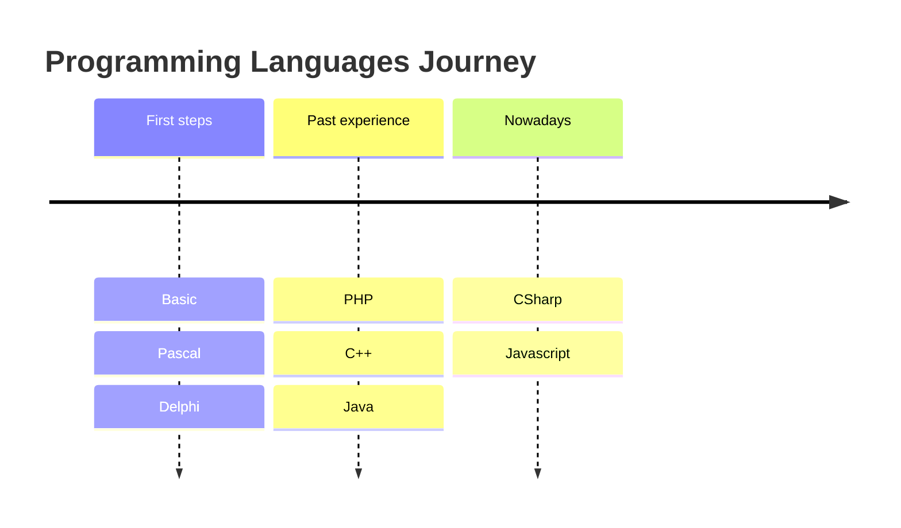

---
# the default layout is 'page'
icon: fas fa-info-circle
order: 4
mermaid: true
---

Hi, I'm Alexander. Nice to meet you. 👋
---

## Experience

Since I started my journey as an enterprise software test engineer 15 years ago, I've been building applications to simplify my work and that of my colleagues. After all these years of improving my skills and gaining experience, I continue to build small and bigger projects playing with different technology stacks and I really enjoy this process.



```js
const experience = [
  { role: 'Software Developer', years: 2 },
  { role: 'SDET', years: 5 },
  { role: 'QA Engineer', years: 10 },
];

const languages = ['C#', 'JavaScript', 'TypeScript', 'Java', 'PHP', 'C++',
  'Delphi', 'Pascal', 'Basic'];

const tools = ['Apache', 'ASP.NET', 'Azure', 'CodeceptJS', 'Git', 'Jenkins',
  'JMeter', 'JSP', 'MSSQL', 'Node.js', 'Nuke', 'Playwright', 'Postman',
  'Selenium', 'SQLite', 'SVN', 'TFS', 'Tomcat', 'Webpack', 'WinForms', 'WPF'];

const os = ['Windows', 'Linux'];

const others = ['Raspberry Pi', 'Arduino', 'NodeMCU', 'ESP8266'];

function describeExperience() {
  const yearsOfExperience = experience.reduce((total, job) => total + job.years, 0);
  const jobHistory = experience.map(job => `${job.role} for ${job.years} years`);
  const skills = [...programmingLanguages, ...tools, ...os, ...others];

  return `With ${yearsOfExperience} years of experience, ` +
    `I've worked as a ${jobHistory.join(', ')}. My skills include ${skills.join(', ')}.`;
}
```

<script>
const experience = [
  { role: 'Software Developer', years: 2 },
  { role: 'SDET', years: 5 },
  { role: 'QA Engineer', years: 10 },
];

const languages = ['C#', 'JavaScript', 'TypeScript', 'Java', 'PHP', 'C++',
  'Delphi', 'Pascal', 'Basic'];

const tools = ['Apache', 'ASP.NET', 'Azure', 'CodeceptJS', 'Git', 'Jenkins',
  'JMeter', 'JSP', 'MSSQL', 'Node.js', 'Nuke', 'Playwright', 'Postman',
  'Selenium', 'SQLite', 'SVN', 'TFS', 'Tomcat', 'Webpack', 'WinForms', 'WPF'];

const os = ['Windows', 'Linux'];

const others = ['Raspberry Pi', 'Arduino', 'NodeMCU', 'ESP8266'];

function describeExperience() {
  const yearsOfExperience = experience.reduce((total, job) => total + job.years, 0);
  const jobHistory = experience.map(job => `${job.role} for ${job.years} years`);
  const skills = [...languages, ...tools, ...os, ...others];

  return `With ${yearsOfExperience} years of experience, ` +
    `I've worked as a ${jobHistory.join(', ')}. My skills include ${skills.join(', ')}.`;
}

function displayOutput() {
  document.getElementById('output-console').textContent = 'Output: ' + describeExperience();
}
</script>

> <a role="button" href="#" onclick="displayOutput()">
>  <span>Click me</span>
> </a> to see the code output.
{: .prompt-tip #output-console }

> Want to know more about my experience? Here are [projects](/categories/projects) I worked on and [tools](/tags) I use.
{: .prompt-info }

Testimonials
------------

People I've worked with have said some nice things...

<div id="carousel" class="carousel slide carousel-fade" data-bs-ride="carousel">
  <div class="carousel-indicators">
    <button type="button" data-bs-target="#carousel" data-bs-slide-to="0" class="active" aria-current="true" aria-label="Slide 1"></button>
    <button type="button" data-bs-target="#carousel" data-bs-slide-to="1" aria-label="Slide 2"></button>
    <button type="button" data-bs-target="#carousel" data-bs-slide-to="2" aria-label="Slide 3"></button>
    <button type="button" data-bs-target="#carousel" data-bs-slide-to="3" aria-label="Slide 4"></button>
  </div>
  <div class="carousel-inner">
    <div class="carousel-item active">
      <svg class="bd-placeholder-img d-block w-100" width="800" height="400" xmlns="http://www.w3.org/2000/svg" role="img" aria-label="Testimonial #1" preserveAspectRatio="xMidYMid slice" focusable="false">
        <rect width="100%" height="100%" fill="##77777720"></rect>
        <switch>
          <foreignObject x="100" y="108" width="600" height="380" font-size="16" style="text-align: center;">
            <p xmlns="http://www.w3.org/1999/xhtml">
              «Lacey and I want you to know that Alexander is a real asset to our team. We previously noticed that he brings thoughtful questions to our planning sessions and he has a good understanding of the product, but when David was on vacation the last two weeks, he did an excellent job of taking on many of her responsibilities. We especially appreciate the work he did to prepare documentation and scenarios for our meeting with client last week.»
            </p>
            <p xmlns="http://www.w3.org/1999/xhtml" style="text-align: right;">
              Senior Program Manager
            </p>
          </foreignObject>
          <text x="20" y="20">Your SVG viewer cannot display html.</text>
        </switch>
      </svg>
    </div>
    <div class="carousel-item">
      <svg class="bd-placeholder-img d-block w-100" width="800" height="400" xmlns="http://www.w3.org/2000/svg" role="img" aria-label="Testimonial #2" preserveAspectRatio="xMidYMid slice" focusable="false">
        <rect width="100%" height="100%" fill="##77777720"></rect>
        <switch>
          <foreignObject x="100" y="108" width="600" height="380" font-size="16" style="text-align: center;">
            <p xmlns="http://www.w3.org/1999/xhtml">
              «You are one of my favorites and I have made it very clear to many people here and at there that you are a valuable member of the team. You quickly learned the product, but more importantly I can see that you are good at looking at the whole picture and not focusing only on the specific thing you are testing. This is a skill that is extremely valuable to an organization. I am sure you will be successful at current position and wherever life takes you.»
            </p>
            <p xmlns="http://www.w3.org/1999/xhtml" style="text-align: right;">
              Senior Program Manager
            </p>
          </foreignObject>
          <text x="20" y="20">Your SVG viewer cannot display html.</text>
        </switch>
      </svg>
    </div>
    <div class="carousel-item">
      <svg class="bd-placeholder-img d-block w-100" width="800" height="400" xmlns="http://www.w3.org/2000/svg" role="img" aria-label="Testimonial #3" preserveAspectRatio="xMidYMid slice" focusable="false">
        <rect width="100%" height="100%" fill="##77777720"></rect>
        <switch>
          <foreignObject x="100" y="48" width="600" height="380" font-size="16" style="text-align: center;">
            <p xmlns="http://www.w3.org/1999/xhtml">
              «Throughout the course of your engagement with us, your dedication and proficiency have not only met but exceeded our expectations. Your commitment to delivering high-quality results has significantly contributed to the success of our projects. We recognize and commend your hard work, attention to detail, and the collaborative spirit you brought to the table. Your contributions have undoubtedly left a lasting impact, and we are grateful for the positive influence you have had on our projects and team dynamics. Thank you bringing out a lot of automation POC’s and not just introducing it but also helping the teams to embrace new automation tools and changes that had happened. Thanks a lot for your contributions and all the best for your future!»
            </p>
            <p xmlns="http://www.w3.org/1999/xhtml" style="text-align: right;">
              Senior QA Team Lead
            </p>
          </foreignObject>
          <text x="20" y="20">Your SVG viewer cannot display html.</text>
        </switch>
      </svg>
    </div>
    <div class="carousel-item">
      <svg class="bd-placeholder-img d-block w-100" width="800" height="400" xmlns="http://www.w3.org/2000/svg" role="img" aria-label="Testimonial #4" preserveAspectRatio="xMidYMid slice" focusable="false">
        <rect width="100%" height="100%" fill="##77777720"></rect>
        <switch>
          <foreignObject x="100" y="148" width="600" height="380" font-size="16" style="text-align: center;">
            <p xmlns="http://www.w3.org/1999/xhtml">
              «I wanted to take a moment to let you know how much I appreciate the knowledge and insights you’ve shared with me. Your guidance has been invaluable, and I’m truly grateful for the opportunity to learn from someone as experienced as you.»
            </p>
            <p xmlns="http://www.w3.org/1999/xhtml" style="text-align: right;">
              SDET
            </p>
          </foreignObject>
          <text x="20" y="20">Your SVG viewer cannot display html.</text>
        </switch>
      </svg>
    </div>
  </div>
  <button class="carousel-control-prev" type="button" data-bs-target="#carousel" data-bs-slide="prev">
    <span class="carousel-control-prev-icon" aria-hidden="true"></span>
    <span class="visually-hidden">Previous</span>
  </button>
  <button class="carousel-control-next" type="button" data-bs-target="#carousel" data-bs-slide="next">
    <span class="carousel-control-next-icon" aria-hidden="true"></span>
    <span class="visually-hidden">Next</span>
  </button>
</div>

<script src="https://cdn.jsdelivr.net/npm/bootstrap@5.3.3/dist/js/bootstrap.bundle.min.js" integrity="sha384-YvpcrYf0tY3lHB60NNkmXc5s9fDVZLESaAA55NDzOxhy9GkcIdslK1eN7N6jIeHz" crossorigin="anonymous"></script>
